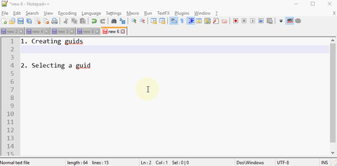

# NppPluginGuidHelper

NppPluginGuidHelper is a Notepad++ plugin to assist you when you handle Guids in Notepad++

It currently features

  * Easy selection of guids - Just Select/Double-click the first or last part of the guid.
  * Easy guid creation - Use the menu. An generate multiple guids using the multi-line rectangular selection (use `alt-shift-down`)

## Installation
Download a binary release and stick the `GuidHelper.dll` inside the `c:\program files (x86)\notepad++\plugins\` folder.

Alternatively, download the source and build it - the build will copy the dll to the notepad folder.

## Final thoughts...

This plugin has been created using the `Notepad++ pluginpack for .Net` https://github.com/kbilsted/NotepadPlusPlusPluginPack.Net/releases

Also check out my blog at http://firstclassthoughts.co.uk/
 
